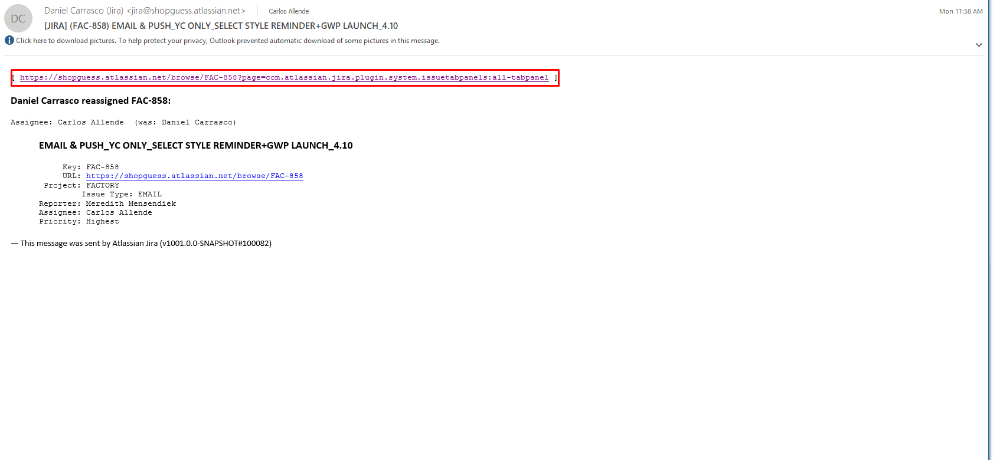

# Building email deliveries with salesforce

1. [You got a Jira ticket](#you-got-a-jira-ticket)
2. [Download slices from Box](#download-slices-from-box)
3. [Managing Images in SalesForce](#managing-images-to-salesforce)
   - [Uploading Images to Salesforce](#managing-images-to-salesforce)
   - [Retrieving Images url in Salesforce](#retrieving-image-url)
   - [Replacing a slice](Replacing-a-slice)
4. [Create new email from template](#creating-a-new-email-from-template)
5. [Building a new email](#creating-a-new-email-from-template)
   - [Inserting slices into an email](#inserting-slices)
   - [Multiple slices in one row](#multiple-slices-in-one-row)
6. [Editing existing parts of the masterTemplate](#Editing-existing-parts-of-the-masterTemplate)

## You got a Jira ticket
From the email notification go to Jira.

You will need to remember the day this email is going to be sent to save the images in the proper folder later. In the screenshot example 4-10.
Once in Jira go to the ticket's folder in Box.

## Download slices from Box

Go to email ticket's folder and download the slices for the email you want to build.

## Managing Images in SalesForce

#### Uploading Images

We usually get a zip folder with the slices, remember to extract those images in order to be able to upload them to salesforce.
We also need to keep organized salesforce FTP server file system in case we need to update a slice. To create a new folder right click on the parent directory and select create folder, then give it a name. Please follow the naming convention, use two digits for the day.
We upload the new images to the folder with the right date name, inside the pictures folder. In this case we navigate to pictures then to FY19, then month April and finally day, the 10th, once we are in that folder dragging and dropping the images will upload them to salesforce.

#### Retrieving Image url

Select the image and copy the url from the image detail page.

#### Replacing a slice

When a slice needs to be updated, if the url of the old image is already in your html the fastest way to do it is replacing the the slice rather than the url. Salesforce will keep the url but load the new image. To replace the image go to the folder where is saved, it should match the day and month of the delivery for that email, find it based on the name of the email and hit replace in the dropdown menu, then select the new image to swap it.

## Creating a new email from template

Once you have [uploaded all the slices to the right folder in salesforce](#uploading-images), navigate to the correct email folder and create a new email. In our example the ticket is for a Guess Factory product email on April 10th.
We will go to Content Builder/FY2019/Q1/Guess Factory/PRODUCT and hit Create and from the drop down menu select email.

Make sure to choose "from template" when creating the new email and pick the right masterTemplate for your brand and country.
Then, give it the right name, you can get it from the Jira ticket and save it in your current folder which should be named after the day, month, quarter, and brand you are working on.

Emails created this way look a bit different in the folder they are saved in. You will notice it says email created from template.

## Building a new email

#### Editing existing parts of the masterTemplate
Once you have updated the subject, be sure to select the Layout tab, and you can edit any part of the email by hovering on it and clicking to edit. Hit done when you got the desired result.

If you want that the changes you just made to a specific part of the template to remain  for the next email you create for this brand and country, update the part before leaving this snippet.

#### Inserting slices
From the layout view of the edit email window select the Image wizard from the Blocks tabs. The wizard will ask you what image you want to insert, browse to the folder where you previously saved the image for this email, it should match the date in which will be sent. Then add "alt" and "alias" values. Alt will render in case the picture fails to be loaded and alias is the tag which clicks on this slice will be tracked.

#### Multiple slices in one row

In the case that we need to add more than one image in a row we have prepared special HTML blocks that contain all the code necessariy to build a row with 2, 3, 4, 5, and 6 slices. You can find this blocks under the Template Blocks folder inside Content Builder.

To add them, we need to select the right html content block. From the Lauout view of the edit email window, select the content tab, here you will find custome blocks that can be added to the email by drag and drop. Navigate to the folder earlier mentioned in Content Builder/Template Blocks/ and drag and drop the block you need to the exact location the email.

In the HTML editor that is served after dropping the html block on the email, you need to update alias, href and src attributes for each slice starting from the left. "Alias" is the tag that is added to each click on this slices for reporting and tracking purpuses, "href" is the link where the slice should click to, you can find this in a document in the box folder of the ticket you are working on, and "src" is the url where the image lives.  [How to get image url?](#retrieving-image-url). Hit Done Editing when you finished.

 

## The Grid

We created an external site called [GRIDSTER](https://gridie.herokuapp.com) that allows to produce a customized grid based on brand and category or any product list page (PLP). You can access it by going to https://gridie.herokuapp.com.

For more information contact: callende@guess.com

